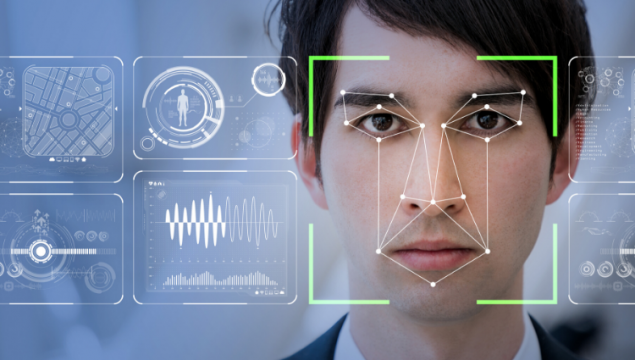
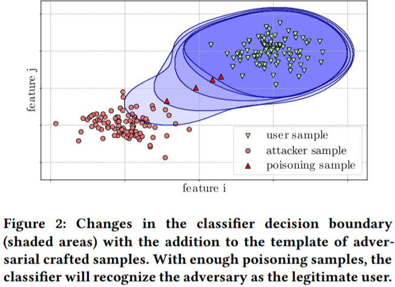

# Biometric-Backdoors

## ABSTRACT

* In recent years, biometric authentication has become one of the
preferred ways to mitigate burdens associated with passwords. With
a long history of research, face and fingerprint recognition are
the most popular modalities and authentication systems based on
them are commonly delivered with consumer products. 

* While early research focused on the performance of these modalities under a
zero-effort threat model, current trends in biometric systems are
also prioritizing high protection of biometric templates, i.e., the
users stored biometric information. Templates in fact represent
sensitive user data and their leak might compromise the secrecy of
the biometric trait in a permanent way.

* **An adversary(Attacker) can exploit the template update procedure to cause the system to adapt the template, thereby indirectly modifying the data within. In fact, during template update, the system replaces or adds recently seen samples to the user template. In this attack, the adversary corrupts the user template allowing himself to impersonate the user with his own biometric trait. The poisoned template is hard to detectand creates an inconspicuous and stealthy backdoor for the adversary in the long-term. Once placed, the backdoor allows the adversary to access the system without requiring them to modify their appearance.**

## Contributions to Repository

1. Introduction towards Face recognition systems.
2. Adversarial ML Attacks.
3. Poisoning Sample Generation.
4. Poisoning Attack Injection.
5. Evaluation Techniques for Adversarial ML Attacks.

## 1. Face Recognition

1. Face Recognition is a recognition technique used to detect faces of individuals whose images saved in the data set. Despite the point that other methods of identification can be more accurate, face recognition has always remained a significant focus of research because of its non-meddling nature and because it is people’s facile method of personal identification.

2. **Neural Network** has continued to use pattern recognition and classification. Kohonen was the first to show that a neuron network could be used to recognise aligned and normalised faces. There are methods, which perform feature extraction using neural networks. There are many methods, which **combined with tools like SVM's, logistic regression, etc and make a hybrid classifier for face recognition**.

3. We will use **FACENET** model for feature extraction and **ONE-CLASS SVM** as a system detector in practise.

## 2. Adversarial ML Attacks

1. Our deep neural networks are powerful machines, but what we don’t understand can hurt us. As sophisticated as they are, they’re highly vulnerable to small attacks that can radically change their outputs.

2. We can manipulate Input by using our knowledge of the training model and the purpose of the attack. A targeted attack, for example, manipulates the input images to change the classifier. The input can be used to cause the machine to see what the attacker wants. In some cases, it’s possible to accomplish this by changing only one pixel.
These attacks aren’t noise. Noise is random or uncontrolled interference. Attacker can control perturbations so that they aren’t detectable to standard noise filters. This is what makes these attacks so dangerous

## Paper Overview

**Download paper from  <a href="https://github.com/Adk2001tech/Biometric-Backdoors/blob/main/poisoning%20attacks%20biometrics.pdf">here</a>**

* The adversaries overarching goal is to place a “biometric backdoor”
which grants them stealthy long-term access to the secured system
without requiring further effort once the backdoor is in place

* Objectives. The attacker’s goals are to:

                      • Cause modifications of the user template that leads to the attacker being accepted.
                      • Maintain the stealthiness of the attack, i.e., minimizing the
                      changes to false rejects (FRR) and false accepts (FAR).
                      • Minimize the number of physical accesses to the system required to plant the backdoor.
                      • Minimize the number of samples rejected by the recognition
                      system.
                      
* The concept behind the poisoning attack is that the adversary adds
adversarial samples to the legitimate user template in order to
change the decision boundary of the classifier. Figure 2 shows a
two-dimensional representation of how the attack works. There
are three categories of samples:

                    • user (victim) samples: legitimate user samples;
                    • attacker samples: samples coming from the biometric trait of the adversary;
                    • poisoning samples: samples algorithmically crafted by the adversary.
                    
 
 
 

Figure 2 shows how the user and attacker samples are well separated
in the feature space, due to the uniqueness of their biometric traits.
At enrolment, the classifier learns the distribution of the user samples creating a boundary around it, shown by the darker blue area.
The classifier is able to correctly discriminate between attacker and
user samples, rejecting the adversary in an impersonation attempt.

Knowing his own template and a user sample as the starting
point, the adversary crafts the poisoning samples accordingly. As
the self-update threshold is in place, the adversary must make sure
that the crafted samples lie within the current accepted region
(shaded blue area), otherwise they would be rejected as anomalous.
By injecting one poisoning sample at a time, the adversary shifts
the decision boundary towards his own sample distribution. With
sufficient poisoning samples, the adversary will move the decision
boundary enough so that his own samples will fall inside it, and
can therefore impersonate the user with his own trait.
                    

## Poisoning Sample Generation

<a href="https://github.com/Adk2001tech/Biometric-Backdoors/blob/main/Notebooks/Face_Detection_basic.ipynb">Link1</a>

Basic Introduction towards Face Detection Algorithm

<a href="https://github.com/Adk2001tech/Biometric-Backdoors/blob/main/Notebooks/Biometric_Backdoors_Part1_INTRO.ipynb">Link2</a>

Project Overview

<a href="https://github.com/Adk2001tech/Biometric-Backdoors/blob/main/Notebooks/Poisoning%20Samples%20Generation%20Part(2.1)%20CENTROID.ipynb">Link3</a>

**Poisoning Sample Generation**: Centroid Shifting 

<a href="https://github.com/Adk2001tech/Biometric-Backdoors/blob/main/Notebooks/Poisoning%20Samples%20Generation%20Part(2.2)%20Target.ipynb">Link4</a>

**Poisoning Sample Generation**: Target shifting
