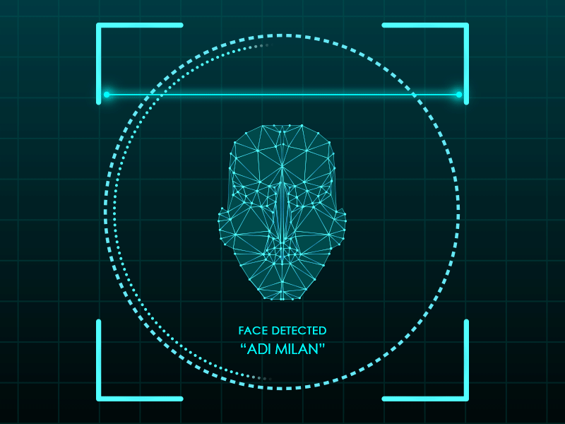
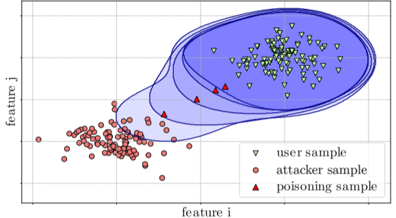
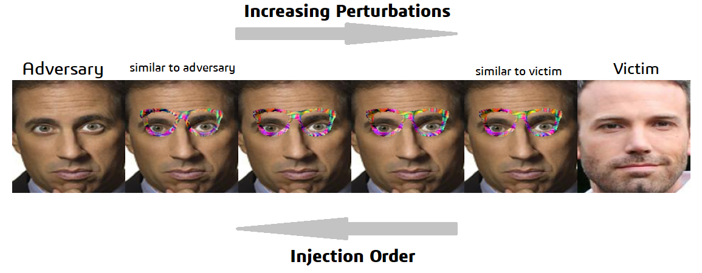

# Biometric-Backdoors

## ABSTRACT

* In recent years, biometric authentication has become one of the
preferred ways to mitigate burdens associated with passwords. With
a long history of research, face and fingerprint recognition are
the most popular modalities and authentication systems based on
them are commonly delivered with consumer products. 

* Implementation from <a href="https://arxiv.org/abs/1905.09162">Paper</a>

 

## 1. Face Recognition

1. Face Recognition is a recognition technique used to detect faces of individuals whose images saved in the data set. Despite the point that other methods of identification can be more accurate, face recognition has always remained a significant focus of research because of its non-meddling nature and because it is people’s facile method of personal identification.

2. **Neural Network** has continued to use pattern recognition and classification. I used these them as a feature vector(128) extractor. There are many methods, which **combined with tools like SVM's, logistic regression, etc and make a hybrid classifier for face recognition**.

3. Will use **FACENET** model for feature extraction method and **ONE-CLASS SVM** as a system detector.

4. **Refer <a href="https://github.com/Adk2001tech/Biometric-Backdoors/blob/main/Notebooks/Face_Detection_basic.ipynb">NOTEBOOK</a> for more details**

 

## 2. Adversarial ML Attacks

1. Our deep neural networks are powerful machines, but what we don’t understand can hurt us. As sophisticated as they are, they’re highly vulnerable to small attacks that can radically change their outputs.

2. We can manipulate Input by using our knowledge of the training model and the purpose of the attack. A targeted attack, for example, manipulates the input images to change the classifier. The input can be used to cause the machine to see what the attacker wants. In some cases, it’s possible to accomplish this by changing only one pixel. Attacker can control perturbations so that they aren’t detectable to standard noise filters. This is what makes these attacks so dangerous!

 

## 3. Paper Overview

 

**Download paper(highlighted) from  <a href="https://github.com/Adk2001tech/Biometric-Backdoors/blob/main/poisoning%20attacks%20biometrics.pdf">HERE</a>. Refer <a href="https://github.com/Adk2001tech/Biometric-Backdoors/blob/main/Notebooks/Biometric_Backdoors_Part1_INTRO.ipynb">NOTEBOOK</a> for more details**

**The contributions of this paper are as follows:**
 * **They propose a method to plant biometric backdoors by poisoning the legitimate user’s template in minimal knowledge and limited injection capabilities scenarios.**
* **They evaluate the attack on state-of-the-art recognition pipelines,including white- and black-box models. They have show that the error rates of the system hardly change when such a backdoor is present, making the attack inconspicuous.**
* **They introduce a poisoning detection method that thwarts poisoning attacks without affecting legitimate template updates, and They have investigate these trade-offs on a large face dataset.**

Figure shows how the user and attacker samples are well separated
in the feature space, due to the uniqueness of their biometric traits.
At enrolment, the classifier learns the distribution of the user samples creating a boundary around it, shown by the darker blue area.
The classifier is able to correctly discriminate between attacker and
user samples, rejecting the adversary in an impersonation attempt.

  

## 4.. Poisoning Sample Generation

**Refer <a href="https://github.com/Adk2001tech/Biometric-Backdoors/blob/main/Notebooks/Poisoning%20Samples%20Generation%20Part(2.2)%20Target.ipynb">NOTEBOOK</a> for more  section details**

 
 

 

1. I have considered **FACE-NET** DNN model as building block of our attack: Also(as per paper) the adversary can craft
coloured glasses and wear them in order to carry out the attack.
The glasses should be re-crafted at each injection step in order to
achieve the correct location in features space. 

 
2. In System Face detection model/classifier , I consider *ben affleck* as a  Legitimate user and *Jerry Seinfeld* as Attacker.

3. In figure shown(right side), the system is trained on Legitimate user data and it's learned decision boundary.

4.**Successfully implemented Algorithm1(from paper) mapping from Target vector/feature space to Adversarial's own feature space with appropriate Glass perturbations**
as shown in figure(2D).

  

## 4. Poisoning Attack Injection

**Refer <a href="https://github.com/Adk2001tech/Biometric-Backdoors/blob/main/Notebooks/Poisoning%20Samples%20Generation%20Part(2.2)%20Target.ipynb">NOTEBOOK</a> for more  section details**

1. **They use the impostor acceptance rate (IAR) as an indicator for injection (i.e., the proportion of attacker samples that are accepted by the system as legitimate).**
 
2. **I consider that the adversary can successfully inject a sample when at least a θ2 fraction of the attackers samples (as they are wearing the glasses) are accepted by the system. Whenever the adversary attempts to inject a sample, if less than θ2 of his samples are accepted by the system I consider the attempt a failure. In this case, the adversary will increase the amount of perturbations on the glasses (move closer to the user’s template), and attempt again. In the cases where more than θ2 samples are accepted, then I consider the attempt successful and inject one of these accepted samples into the current user template (chosen at random).**
**The algorithm stops when at least θ1 fraction of the attacker
samples, while wearing no glasses , is accepted by the system**

4. Figure shows, modified(2D) decision boundary of system's model. 

   
   
  

### 5. Visualization of intermediate poisoning samples

### 6. POISONING COUNTERMEASURES

1. We propose a new detection technique, based on the rationale that poisoning samples will all lie in a predetermined direction in feature space with respect to the current legitimate user centroid. The direction is determined based on the location of the attacker samples.

2. Given the user’s current centroid Xc and a set of template updates {Xi , Xi+1, ..., Xi+n }, which we refer to as an update sequence, we compute the direction of the update at time i: **∆Xi = Xc − Xi** and we can obtain the directions at each step as {∆Xi , ..., ∆Xi+n }. We then compute the angular similarity for pairs of consecutive updates with the **Cosine Similarity.**

3. **The underlying intuition is that COSθi(Cosine Similarity) will be higher for pairs of poisoning samples compared to legitimate updates because the poisoning attack needs to shift the current user centroid towards the adversary’s, which lies in a specific pre-defined direction.**

 

 
 

<a href="https://github.com/Adk2001tech/Biometric-Backdoors/blob/main/Notebooks/Face_Detection_basic.ipynb">Link1</a>

Basic Introduction towards Face Detection Algorithm

<a href="https://github.com/Adk2001tech/Biometric-Backdoors/blob/main/Notebooks/Biometric_Backdoors_Part1_INTRO.ipynb">Link2</a>

Project Overview

<a href="https://github.com/Adk2001tech/Biometric-Backdoors/blob/main/Notebooks/Poisoning%20Samples%20Generation%20Part(2.1)%20CENTROID.ipynb">Link3</a>

**Poisoning Sample Generation**: Centroid Shifting 

<a href="https://github.com/Adk2001tech/Biometric-Backdoors/blob/main/Notebooks/Poisoning%20Samples%20Generation%20Part(2.2)%20Target.ipynb">Link4</a>

**Poisoning Sample Generation**: Target shifting
